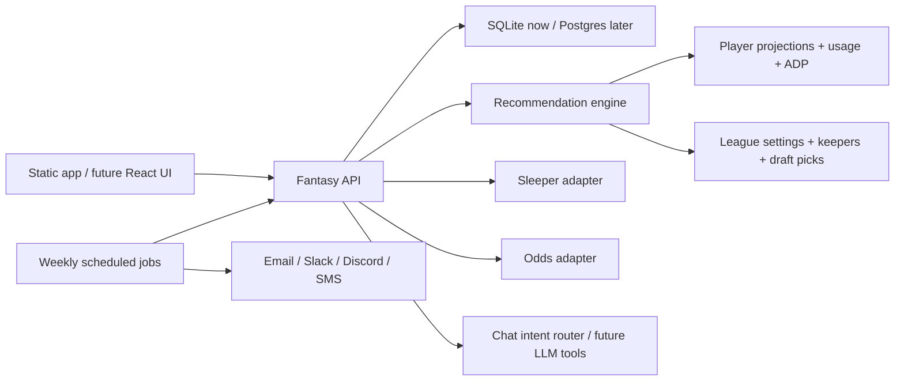

# Fantasy Football Chatbot

A local-first MVP for a fantasy football draft and roster assistant. It has a working browser UI, a Python API, SQLite persistence, a recommendation engine, Sleeper integration hooks, manual keeper input, waiver riser rankings, and a simple explainable chatbot route.

## Recommended Stack

For production, I would build this as:

- **Frontend:** Next.js + React + TypeScript for the app UI and draft-room workflow.
- **Backend:** FastAPI or NestJS for typed API routes, background jobs, and provider adapters.
- **Database:** Postgres for normalized league/player/history data, plus `pgvector` for searchable news/player notes.
- **Cache/queues:** Redis + a worker queue for schedule-based imports, odds refreshes, injury/news polling, and weekly notifications.
- **LLM/chat layer:** OpenAI Responses API or an equivalent model layer, with tool calls into your own recommendation endpoints rather than letting the model invent fantasy advice.
- **Notifications:** Email first, then Slack/Discord/SMS once the weekly ranking job is stable.

This repo starts smaller on purpose: the MVP runs with the Python standard library and SQLite, so the shape is testable before introducing deployment and dependency weight.

## Data Sources

Recommended source strategy:

- **Sleeper:** Primary league integration. Use it for users, leagues, rosters, drafts, draft picks, players, and trending adds/drops.
- **Projection/ranking feeds:** Import rankings/projections as JSON rows first, then add paid or licensed sources for current projections, ADP, weekly ranks, injuries, depth charts, snap counts, and route data.
- **Odds feed:** Use The Odds API or a similar provider for spreads, totals, moneylines, implied team totals, and line movement.
- **ESPN/NFL.com:** Treat these as optional adapters. Do not make them core dependencies unless you have authenticated, licensed, or otherwise stable access.

Useful docs:

- [Sleeper API docs](https://docs.sleeper.com/)
- [The Odds API docs](https://the-odds-api.com/liveapi/guides/v4/)
- [OpenAI API docs](https://platform.openai.com/docs/)

## Architecture



## Database Shape

The MVP stores league state plus normalized multi-source player data:

- `league_settings`: team count, scoring format, draft slot, roster slots.
- `keepers`: manually entered kept players, team, round, and pick.
- `draft_picks`: live draft picks marked as yours or an opponent's.
- `players`: canonical player identities, using Sleeper as the primary identity source.
- `player_source_rankings`: imported source rankings, ADP, projections, tiers, bye weeks, and raw JSON.
- `source_import_runs`: import status, counts, and error tracking.

Production should add:

- `player_identities`, `teams`, `games`, `weekly_stats`, `depth_charts`, `injuries`, `odds_snapshots`, `news_items`, `league_rosters`, `recommendation_runs`, and `notification_runs`.

## Run Locally

```bash
python3 -m backend.app.main
```

Open [http://127.0.0.1:8787](http://127.0.0.1:8787).

## Test

```bash
python3 -m unittest discover backend/tests
```

## MVP Workflow

1. Set league settings in the Setup tab.
2. Click **Import Sleeper Players** to load the real NFL player pool into SQLite.
3. Import rankings/projections JSON from FantasyPros, ESPN, or another source.
4. Add manual keepers if Sleeper keeper data is incomplete.
5. Use the Draft Board to mark picks as they happen.
6. Ask the chatbot draft, keeper, waiver, and matchup questions.
7. Use the Waivers tab to pull enriched Sleeper trending adds when player data is imported.

## Multi-Source Endpoints

- `POST /api/integrations/sleeper/players/import`: imports all fantasy-relevant NFL players from Sleeper.
- `GET /api/players?position=RB&search=chase&active=1`: reads database players first, then falls back to seed data.
- `POST /api/rankings/import/csv`: imports JSON ranking rows under a source name.
- `GET /api/players/consensus?position=RB&limit=100&current_pick=25`: compares available source rankings.
- `GET /api/integrations/sleeper/trending/enriched`: enriches Sleeper trending adds with local player and consensus data.

## Next Build Steps

1. Add real CSV file upload and source-specific column mapping screens.
2. Add scheduled refreshes for Sleeper players, rankings, injuries, odds, and trending adds.
3. Add a proper `notifications` worker that sends the weekly top-5 risers by position.
4. Add LLM tool calling so chat answers can call `draft_recommendations`, `waiver_risers`, `evaluate_keeper`, and matchup endpoints.
5. Add a real auth model for your league/user data before deploying beyond localhost.
