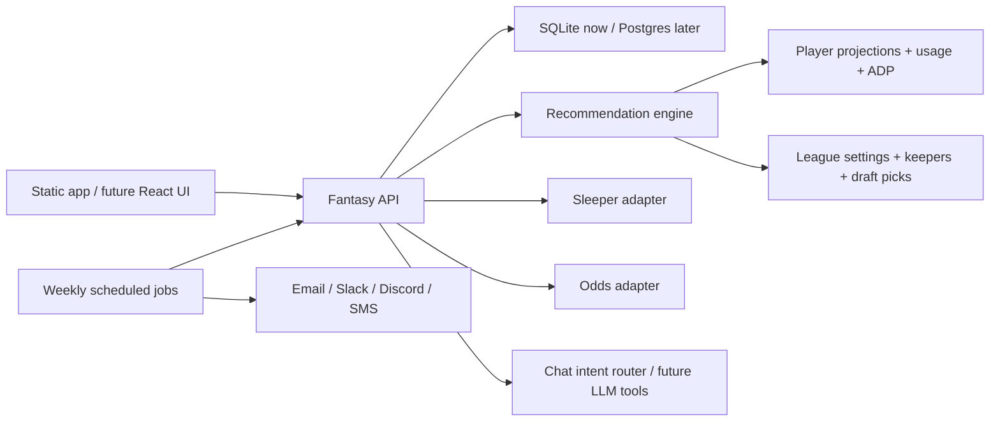

# Fantasy Football Chatbot

A local-first MVP for a fantasy football draft and roster assistant. It has a working browser UI, a Python API, SQLite persistence, a recommendation engine, Sleeper league/player imports, a real draft-board view, a practice draft simulator, a full Players tab, waiver riser rankings, and a simple explainable chatbot route.

## Recommended Stack

For production, I would build this as:

- **Frontend:** Next.js + React + TypeScript for the app UI and draft-room workflow.
- **Backend:** FastAPI or NestJS for typed API routes, background jobs, and provider adapters.
- **Database:** Postgres for normalized league/player/history data, plus `pgvector` for searchable news/player notes.
- **Cache/queues:** Redis + a worker queue for schedule-based imports, odds refreshes, injury/news polling, and weekly notifications.
- **LLM/chat layer:** OpenAI Responses API or an equivalent model layer, with tool calls into your own recommendation endpoints rather than letting the model invent fantasy advice.
- **Notifications:** Email first, then Slack/Discord/SMS once the weekly ranking job is stable.

This repo starts smaller on purpose: the MVP runs with the Python standard library and SQLite, so the shape is testable before introducing deployment and dependency weight.

## Data Sources

Recommended source strategy:

- **Sleeper:** Primary league integration. Use it for users, leagues, rosters, drafts, draft picks, players, and trending adds/drops.
- **Projection/ranking feeds:** Import rankings/projections as JSON rows first, then add paid or licensed sources for current projections, ADP, weekly ranks, injuries, depth charts, snap counts, and route data.
- **Odds and props feeds:** Use The Odds API or a similar licensed provider for sportsbook lines, props, spreads, totals, implied team totals, and line movement.
- **ESPN, DraftKings, FanDuel, Caesars, Draft365:** Represented as adapters or importable source names. If a source has no clean public API configured, the adapter returns a clear "not configured" message instead of scraping or crashing.

Useful docs:

- [Sleeper API docs](https://docs.sleeper.com/)
- [The Odds API docs](https://the-odds-api.com/liveapi/guides/v4/)
- [OpenAI API docs](https://platform.openai.com/docs/)

## Architecture



## Database Shape

The MVP stores league state plus normalized multi-source player data:

- `league_settings`: team count, scoring format, draft slot, roster slots.
- `keepers`: manually entered kept players, team, round, and pick.
- `draft_picks`: live draft picks marked as yours or an opponent's.
- `players`: canonical player identities, using Sleeper as the primary identity source.
- `player_source_rankings`: imported source rankings, ADP, projections, tiers, bye weeks, and raw JSON.
- `source_import_runs`: import status, counts, and error tracking.
- `sleeper_leagues`, `league_managers`, `league_drafts`, `league_draft_picks`, `draft_slots`, `user_draft_picks`: imported Sleeper league context for the real draft board.
- `manager_draft_tendencies`: simple league-mate draft history tendencies by round and position.
- `practice_drafts`, `practice_draft_picks`: saved local practice draft state.
- `player_stat_lines`, `player_props`, `player_news`: optional imported player detail data.

Production should add:

- `player_identities`, `teams`, `games`, `weekly_stats`, `depth_charts`, `injuries`, `odds_snapshots`, `news_items`, `league_rosters`, `recommendation_runs`, and `notification_runs`.

## Run Locally

```bash
python3 -m backend.app.main
```

Open [http://127.0.0.1:8787](http://127.0.0.1:8787).

On startup the server initializes SQLite and checks for Sleeper-sourced players. If none exist, or if the last Sleeper player import is older than the refresh window, it imports the fantasy-relevant NFL player pool automatically. The Setup button is still available as **Refresh Sleeper Players** for manual refreshes.

## Test

```bash
python3 -m unittest discover backend/tests
```

## MVP Workflow

1. Run the app. Sleeper players auto-load if missing.
2. Enter a Sleeper league ID in Setup and click **Import League**.
3. The app imports league settings, managers, rosters, drafts, draft picks, draft order, available traded-pick data, and recent discoverable draft history.
4. If the app cannot know which roster is yours, choose it from **My Team** and save it.
5. Use the Draft Board tab to see the full manager-by-round grid, highlighted picks, upcoming picks, likely available players, and best available recommendations.
6. Use the **Mock Draft** tab: start a mock, click the on-the-clock board cell for a compact pick sheet, draft, simulate opponents (not while you are on the clock), and reset.
7. In Setup, mark favorite players, set reach/value bias, and refresh optional Sleeper projections or Odds API data.
8. Use the Players tab to search/filter the player database and open a detail view with profile, rankings, stats, projections, props, news, and notes.
9. Import rankings, stats, or props JSON when a provider does not have a configured official/licensed API (use `source_name = espn` for ESPN-style exports).
10. Ask the chatbot draft, keeper, waiver, and matchup questions.
11. Use the Waivers tab to pull enriched Sleeper trending adds when player data is imported.

See [docs/data_sources.md](docs/data_sources.md) for which env keys are real vs placeholders.

## Multi-Source Endpoints

- `POST /api/integrations/sleeper/players/import`: imports all fantasy-relevant NFL players from Sleeper.
- `POST /api/integrations/sleeper/import`: imports Sleeper league settings, managers, rosters, drafts, picks, and draft order.
- `GET /api/players?position=RB&search=chase&active=1`: reads database players first, then falls back to seed data.
- `GET /api/players/search?position=WR&team=CIN&search=chase`: searches the player database with filters.
- `GET /api/players/detail?player_id=sleeper_...`: returns profile, rankings, stats, props, news, and notes.
- `POST /api/rankings/import/csv`: imports JSON ranking rows under a source name.
- `POST /api/player-stats/import/json`: imports actual/projected/career stat lines.
- `POST /api/player-props/import/json`: imports sportsbook player prop lines.
- `GET /api/players/consensus?position=RB&limit=100&current_pick=25`: compares available source rankings.
- `GET /api/draft/board?league_id=...`: returns the Sleeper league draft grid, managers, my team, my picks, and likely available players.
- `GET /api/draft/availability?league_id=...&pick_no=25`: estimates which players may last to a future pick.
- `POST /api/practice/start`, `POST /api/practice/simulate-next`, `POST /api/practice/simulate-to-my-next-pick`, `POST /api/practice/pick`, `DELETE /api/practice/reset`: manage a saved mock draft.
- `GET /api/draft/recommendations?league_id=...&pick_no=...`: league-aware pick sheet recommendations.
- `GET /api/setup/data-sources`: configured vs missing integrations and last import times.
- `GET/POST/DELETE /api/user/favorites`, `GET/POST /api/user/draft-preferences`, `POST /api/user/tendencies/calculate`: personal ranking signals.
- `POST /api/integrations/sleeper/projections/import`, `POST /api/integrations/odds/import`, `POST /api/integrations/odds/props/import`: optional live feeds.
- `GET /api/integrations/sleeper/trending/enriched`: enriches Sleeper trending adds with local player and consensus data.

## Next Build Steps

1. Add real CSV file upload and source-specific column mapping screens.
2. Add scheduled refreshes for rankings, injuries, stats, props, odds, and trending adds.
3. Improve availability prediction with roster construction, manager tendencies, tiers, and position runs.
4. Add a proper `notifications` worker that sends the weekly top-5 risers by position.
5. Add LLM tool calling so chat answers can call `get_players`, `get_player_detail`, `get_draft_board`, `draft_recommendations`, `waiver_risers`, `evaluate_keeper`, and matchup endpoints.
6. Add a real auth model for your league/user data before deploying beyond localhost.
